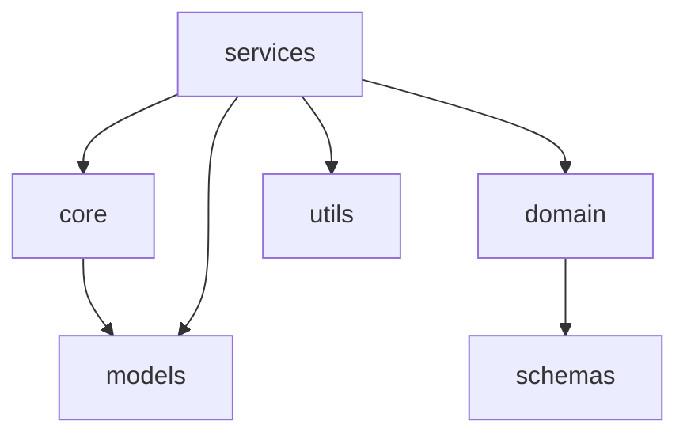

# PREDAIOT — Architecture (auto-generated by tools/arch_graph.py)

> Do not edit by hand. Regenerate with `python tools/arch_graph.py`.

## Package dependency graph

## Package metrics

| Layer | Files | LOC | Largest module |
|---|--:|--:|---|
| __init__ | 1 | 6 | __init__ (6 L) |
| services | 12 | 2215 | services.report_service (354 L) |
| core | 7 | 360 | core.dependencies (153 L) |
| utils | 2 | 27 | utils.formatting (27 L) |
| models | 2 | 411 | models.tables (402 L) |
| schemas | 1 | 266 | schemas (266 L) |

## Dependency-rule check

- Hard violations (upward/circular): **0**
- Peer edges (same-layer, tracked as debt D1/D11): **0**

- Modules scanned: 25

